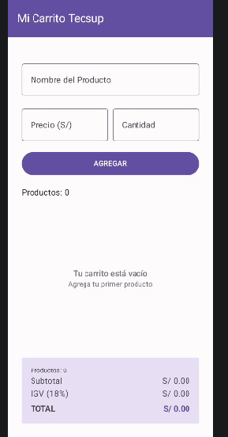
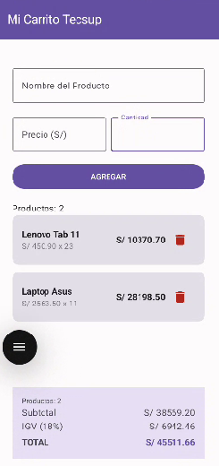

# Lab04CarritoTecsup

**Autor:** Gael La Jara

## Descripción

Aplicación de carrito de compras desarrollada en Kotlin con Jetpack Compose para el Laboratorio 04. Integra un formulario de captura de productos, una lista dinámica y desplazable con LazyColumn, eliminación de elementos y un panel de totales (subtotal, IGV 18% y total) que se recalcula en tiempo real.

## Capturas

**Carrito vacío**

**Carrito con productos**

## Respuestas conceptuales

**a) ¿Por qué `mutableStateListOf` y no una `MutableList` normal?**

Porque `mutableStateListOf` crea una lista *observable* por Compose: cada vez que se agrega o elimina un elemento, Compose detecta el cambio y vuelve a dibujar automáticamente la `LazyColumn` y todo lo que dependa de esa lista (como el contador de productos o el panel de totales). Una `MutableList` normal no está conectada al sistema de estado de Compose, así que aunque el dato cambie internamente, la pantalla no se actualiza sola.

**b) ¿Por qué la lista se declara con `val` y aun así podemos agregarle elementos?**

`val` en Kotlin impide reasignar la *referencia* de la variable (no se puede hacer `productos = otraLista`), pero no impide modificar el *contenido* del objeto al que apunta esa referencia. Como `mutableStateListOf()` devuelve una lista mutable, se le pueden agregar o quitar elementos con `.add()` y `.remove()` sin necesidad de reasignar la variable — el objeto lista en sí es mutable, aunque la referencia sea constante.

**c) ¿Qué hace `weight(1f)` en la LazyColumn?**

Hace que la `LazyColumn` ocupe todo el espacio vertical disponible que sobra dentro del `Column` padre, después de que el formulario y el panel de totales tomen el espacio que necesitan. Esto es lo que permite que la lista se estire y sea desplazable, mientras el panel de totales queda siempre fijo en la parte inferior de la pantalla, sin importar cuántos productos tenga el carrito.