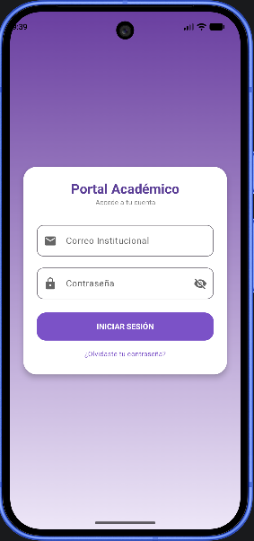
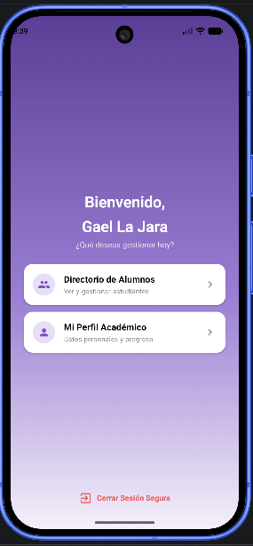
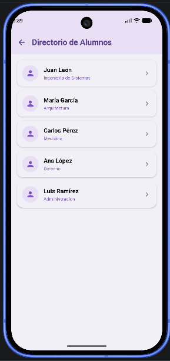
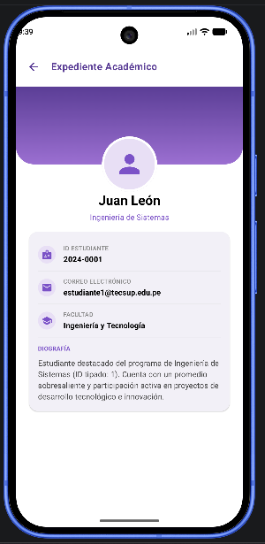
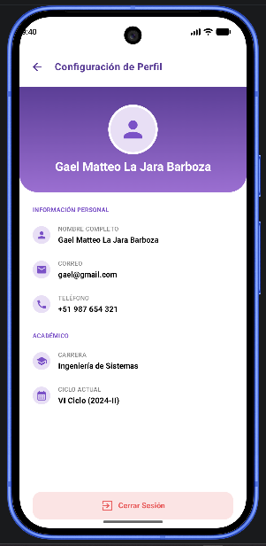

## Laboratorio 05: Navegación en Jetpack Compose

# Alumno: La Jara Barboza, Gael Matteo

# Descripción
Aplicación móvil de práctica que permite navegar entre una pantalla principal, un listado de elementos, el detalle de cada elemento seleccionado y una sección de perfil.

**RF-01: Navegación entre pantallas**
El sistema debe permitir al usuario desplazarse entre las pantallas de Inicio, Lista, Detalle y Perfil de forma fluida dentro de la aplicación.

**RF-02: Listado de elementos**
El sistema debe mostrar al usuario un listado de elementos disponibles, permitiendo seleccionar cualquiera de ellos para ver su información detallada.

**RF-03: Visualización de detalle por elemento**
Al seleccionar un elemento de la lista, el sistema debe mostrar la información correspondiente a ese elemento específico, identificándolo correctamente según la selección realizada.

**RF-04: Retorno a la pantalla anterior**
El sistema debe permitir al usuario regresar a la pantalla anterior desde la vista de Detalle, sin perder el contexto de navegación.

## Rediseño con IA (rama `feature/rama-ia`)
Esta rama contiene una versión de la interfaz rediseñada con apoyo de un agente de IA integrado a Android Studio (Gemini), a partir de un diseño de referencia. El rediseño abarca las 5 pantallas de la app (Login, Bienvenida, Directorio de Alumnos, Expediente Académico y Configuración de Perfil), manteniendo intacta la lógica de navegación original.

### Tecnologías utilizadas
- Kotlin
- Jetpack Compose
- Material3
- Jetpack Navigation Compose

### Estructura de pantallas
- `LoginScreen`: pantalla de acceso (decorativa).
- `HomeScreen`: bienvenida y accesos a Directorio y Perfil.
- `ListScreen`: listado de alumnos.
- `DetailScreen`: expediente académico del alumno seleccionado (recibe `itemId` tipado).
- `ProfileScreen`: configuración de perfil del usuario.

# PROMPT: Reconstrucción visual completa de app académica en Jetpack Compose (desde cero)

## Contexto del proyecto
Tengo un proyecto Android en Jetpack Compose con Material3. Necesito que implementes 5 pantallas completas con navegación entre ellas y el diseño exacto descrito abajo, desde cero. Todos los composables deben ser independientes y reutilizables, en funciones separadas, en archivos propios dentro de un paquete `ui` o `screens`.

## INSTRUCCIÓN CRÍTICA DE SOBRESCRITURA
Si los archivos `LoginScreen.kt`, `HomeScreen.kt`, `ListScreen.kt`, `DetailScreen.kt` o `ProfileScreen.kt` YA EXISTEN en el proyecto (aunque sea con contenido de prueba, placeholder, o una versión anterior simple como un `Text("Pantalla Tecsup")` con un botón), debes REEMPLAZAR COMPLETAMENTE su contenido por el diseño detallado especificado en este prompt. No dejes ni combines código antiguo con el nuevo. No omitas este reemplazo asumiendo que "ya existe algo ahí" — cada una de las 5 pantallas debe terminar con EXACTAMENTE la estructura visual descrita abajo (headers degradados, tarjetas, avatares, etc.), sin importar qué contenido tuvieran antes. Después de escribir cada archivo, verifícalo uno por uno confirmando que no quedó ningún rastro del código placeholder anterior (como textos genéricos "Pantalla Tecsup", "Ver lista de elementos", "Mi perfil" o "Ir al Inicio" sin el diseño completo descrito aquí).

## PASO 0 — Verificar/crear la estructura de navegación
Antes de construir las pantallas, revisa si el proyecto ya tiene los siguientes archivos. Si NO existen, créalos exactamente así:

**Dependencia (build.gradle.kts, Module: app):**
```kotlin
implementation("androidx.navigation:navigation-compose:2.7.7")
```
Después de agregarla, recuerda hacer Sync Now.

**Screen.kt** (rutas de navegación con sealed class):
```kotlin
sealed class Screen(val route: String) {
    object Login : Screen("login")
    object Home : Screen("home")
    object List : Screen("list")
    object Detail : Screen("detail/{itemId}") {
        fun createRoute(itemId: Int): String = "detail/$itemId"
    }
    object Profile : Screen("profile")
}
```

**AppNavigation.kt** (NavHost centralizando la navegación):
```kotlin
@Composable
fun AppNavigation() {
    val navController = rememberNavController()

    NavHost(
        navController = navController,
        startDestination = Screen.Login.route
    ) {
        composable(Screen.Login.route) {
            LoginScreen(navController)
        }
        composable(Screen.Home.route) {
            HomeScreen(navController)
        }
        composable(Screen.List.route) {
            ListScreen(navController)
        }
        composable(
            route = Screen.Detail.route,
            arguments = listOf(navArgument("itemId") { type = NavType.IntType })
        ) { backStackEntry ->
            val itemId = backStackEntry.arguments?.getInt("itemId") ?: 0
            DetailScreen(navController, itemId)
        }
        composable(Screen.Profile.route) {
            ProfileScreen(navController)
        }
    }
}
```

**MainActivity.kt**: dentro de `setContent { }`, envuelto en el tema de la app, debe llamar únicamente a `AppNavigation()`.

Si estos tres archivos (`Screen.kt`, `AppNavigation.kt`, `MainActivity.kt`) YA existen, no los reescribas ni cambies sus nombres de rutas ni la firma de `createRoute`; solo asegúrate de que las 5 pantallas reciban los parámetros (`navController`, `itemId` donde corresponda) tal como se define arriba, para no romper la navegación existente. Sin embargo, esta excepción NO aplica a los archivos de pantallas (`LoginScreen.kt`, `HomeScreen.kt`, etc.) — esos SIEMPRE se sobrescriben por completo según la INSTRUCCIÓN CRÍTICA DE SOBRESCRITURA de arriba.

## Paleta de colores (definir en Color.kt)
- `PurpleDark = Color(0xFF5B3E96)` — morado oscuro, headers y títulos destacados.
- `PurpleAccent = Color(0xFF7B52C7)` — morado medio, botones sólidos y textos de acento.
- `PurpleLight = Color(0xFFE8DFF5)` — lila claro, fondos de chips/avatares.
- `SurfaceGray = Color(0xFFF2F0F7)` — gris/lavanda muy claro, tarjetas.
- `ErrorCoral = Color(0xFFE85D5D)` — rojo/coral, cerrar sesión.
- `ErrorContainerLight = Color(0xFFFBE4E4)` — rosado muy claro, fondo del botón cerrar sesión.
- `GradientHome`: 3 paradas — `0f to Color(0xFF5B3E96)`, `0.55f to Color(0xFF9B7FD4)`, `1f to Color(0xFFF5F0FA)` (de morado oscuro a casi blanco).
- `GradientHeader`: 2 paradas — `Color(0xFF5B3E96)` (arriba) a `Color(0xFF9B6FD1)` (abajo), usado en headers de Detalle y Perfil.
- `GradientLogin`: `Color(0xFF6A3FA0)` (arriba) a `Color(0xFFEDE6F7)` (abajo), usado solo en Login.

## Composables reutilizables a crear primero
1. `GradientBox(brush: Brush, modifier: Modifier, content: @Composable BoxScope.() -> Unit)`: `Box` con `Modifier.background(brush)`.
2. `CircleAvatarPlaceholder(size: Dp, backgroundColor: Color = PurpleLight, iconColor: Color = PurpleAccent, borderColor: Color? = null)`: `Box` circular con `Icons.Default.Person` centrado; si `borderColor` no es null, agrega `Modifier.border(4.dp, borderColor, CircleShape).shadow(4.dp, CircleShape)`.
3. `ActionOptionCard(icon: ImageVector, title: String, subtitle: String, onClick: () -> Unit)`: `Card` blanca, `RoundedCornerShape(16.dp)`, `Row` con ícono en chip circular 40dp fondo `PurpleLight`, columna con título bold negro y subtítulo gris pequeño, ícono `ChevronRight` a la derecha.
4. `StudentListItem(name: String, career: String, onClick: () -> Unit)`: `Card` fondo `SurfaceGray`, `RoundedCornerShape(16.dp)`, elevación 2dp, `Row` con `CircleAvatarPlaceholder(44.dp)`, columna con nombre bold y carrera en `PurpleAccent` pequeño, ícono `ChevronRight` gris a la derecha.
5. `InfoRow(icon: ImageVector, label: String, value: String)`: `Row` con ícono 20dp dentro de chip circular 32dp fondo `PurpleLight`/ícono `PurpleAccent`, columna con `label` en `labelSmall` gris mayúsculas y `value` en `bodyMedium` bold negro debajo.
6. `SectionLabel(text: String)`: `Text` en mayúsculas, `labelSmall`, color `PurpleAccent`, `letterSpacing` ligero.
7. `LogoutButton(text: String, filled: Boolean, onClick: () -> Unit)`: si `filled=true`, `Button` fondo `ErrorContainerLight`, `RoundedCornerShape(16.dp)`, texto+ícono `ErrorCoral`, `fillMaxWidth()`; si `filled=false`, `TextButton` sin fondo, mismo color de texto, centrado.
8. `WhiteTopBar(title: String, onBack: () -> Unit)`: `Row` con `Modifier.fillMaxWidth().background(Color.White).padding(horizontal = 8.dp, vertical = 12.dp)`, `verticalAlignment = Alignment.CenterVertically`, con `IconButton(onClick = onBack)` mostrando `Icon(Icons.AutoMirrored.Filled.ArrowBack, tint = PurpleDark)` y `Text(title, color = PurpleDark, fontWeight = FontWeight.Bold, fontSize = 18.sp)` al lado. Esta barra SIEMPRE va sobre fondo blanco, nunca sobre el degradado — ver regla general abajo.

## REGLA GENERAL para pantallas con header degradado (Expediente y Perfil) — MUY IMPORTANTE
El ícono de retroceso y el título de la pantalla (ej. "Expediente Académico", "Configuración de Perfil") NUNCA deben ir sobre el fondo morado degradado. Deben ir en una barra superior de fondo **blanco sólido**, ubicada ANTES del bloque degradado, como si fuera un `TopAppBar` independiente y separado visualmente del header de color.

Estructura obligatoria para AMBAS pantallas (Detalle y Perfil), de arriba hacia abajo:
1. `Column` raíz con `Modifier.fillMaxSize().statusBarsPadding()` (para que todo, incluida la barra blanca, quede debajo de la barra de estado del sistema).
2. Primer hijo: `WhiteTopBar(title, onBack)` — fondo blanco, back button y título en color `PurpleDark`, ocupando su propio espacio (~56dp de alto).
3. Segundo hijo: el bloque degradado con el avatar (ver detalle por pantalla abajo) — este bloque empieza justo DESPUÉS de la barra blanca, nunca detrás ni superpuesto a ella.

Esto asegura que la secuencia visual sea siempre: **barra de estado del sistema (blanco) → barra de título con back button (blanco) → bloque degradado morado con avatar → cuerpo blanco con datos**.

## FORMA DEL HEADER DEGRADADO — MUY IMPORTANTE
El bloque degradado (el rectángulo morado que contiene el avatar) NO debe ser un rectángulo con esquinas rectas. Debe tener las **esquinas inferiores redondeadas**, dando la sensación de una tarjeta/panel con base curva, no un bloque cuadrado pegado al resto del contenido.

Implementación obligatoria: aplicar al `Box`/`GradientBox` del header el modifier `Modifier.clip(RoundedCornerShape(bottomStart = 32.dp, bottomEnd = 32.dp))` ANTES de aplicar el `Modifier.background(brush)`, de forma que el degradado quede recortado con esas esquinas inferiores curvas de 32dp de radio. Las esquinas superiores permanecen rectas (0dp), ya que están pegadas a la barra blanca de arriba.

## PANTALLA 1 — LoginScreen
Recibe `navController: NavController`.
- `Box` raíz con `GradientBox(GradientLogin)`, `Modifier.fillMaxSize()`.
- Contenido centrado vertical y horizontalmente, padding horizontal 24dp.
- `Card` blanca, `RoundedCornerShape(24.dp)`, elevación 6dp, padding interno 24dp, `fillMaxWidth()`:
    - "Portal Académico": `headlineSmall`, bold, color `PurpleDark`, centrado.
    - "Accede a tu cuenta": `bodySmall`, gris, centrado, debajo.
    - `Spacer(24.dp)`.
    - `OutlinedTextField` "Correo Institucional": ícono `Icons.Default.Email` a la izquierda, `RoundedCornerShape(12.dp)`, `fillMaxWidth()`.
    - `Spacer(12.dp)`.
    - `OutlinedTextField` "Contraseña": ícono `Icons.Default.Lock` a la izquierda, ícono `Icons.Default.VisibilityOff` a la derecha (toggle), `visualTransformation = PasswordVisualTransformation()`, mismo shape.
    - `Spacer(24.dp)`.
    - `Button` "INICIAR SESIÓN": `fillMaxWidth()`, altura 50dp, fondo `PurpleAccent`, texto blanco bold mayúsculas, `RoundedCornerShape(16.dp)`. Al hacer click, navega a `Screen.Home.route` (sin validación real, decorativo).
    - `Spacer(12.dp)`.
    - "¿Olvidaste tu contraseña?": `bodySmall`, color `PurpleAccent`, centrado.

## PANTALLA 2 — HomeScreen (Bienvenida)
Recibe `navController: NavController`.
- `Box` raíz con `GradientBox(GradientHome)`, `Modifier.fillMaxSize()`.
- Dentro, un `Column` con `Modifier.align(Alignment.Center).fillMaxWidth().padding(horizontal = 24.dp)`, `horizontalAlignment = Alignment.CenterHorizontally` (el bloque de texto debe estar completamente centrado tanto vertical como horizontalmente en el espacio disponible de la pantalla), conteniendo:
    - "Bienvenido,": `headlineMedium`, bold, blanco, `TextAlign.Center`, `Modifier.fillMaxWidth()`.
    - `Spacer(Modifier.height(8.dp))` (espaciado claro entre ambas líneas).
    - "Gael La Jara": `headlineMedium`, bold, blanco, `TextAlign.Center`, `Modifier.fillMaxWidth()`.
    - `Spacer(Modifier.height(4.dp))`.
    - "¿Qué deseas gestionar hoy?": `bodyMedium`, blanco con alpha 0.8f, `TextAlign.Center`, `Modifier.fillMaxWidth()`.
    - `Spacer(Modifier.height(24.dp))`.
    - `ActionOptionCard` "Directorio de Alumnos" / "Ver y gestionar estudiantes" / ícono `Icons.Default.People` → navega a `Screen.List.route` (las tarjetas mantienen `fillMaxWidth()`, no se centran como el texto).
    - `Spacer(Modifier.height(12.dp))`.
    - `ActionOptionCard` "Mi Perfil Académico" / "Datos personales y progreso" / ícono `Icons.Default.Person` → navega a `Screen.Profile.route`.
- El botón `LogoutButton("Cerrar Sesión Segura", filled = false)` va aparte, con `Modifier.align(Alignment.BottomCenter).padding(bottom = 32.dp)`, anclado siempre al final de la pantalla, independiente del bloque centrado de arriba.

## PANTALLA 3 — ListScreen (Directorio de Alumnos)
Recibe `navController: NavController`.
- `Scaffold` con `TopAppBar`:
    - `containerColor = PurpleLight`.
    - `navigationIcon`: `IconButton` con `Icons.AutoMirrored.Filled.ArrowBack`, color `PurpleDark`, `onClick = { navController.popBackStack() }`.
    - `title`: "Directorio de Alumnos", color `PurpleDark`, bold.
- Cuerpo: fondo `SurfaceGray` o blanco, `LazyColumn` con `contentPadding = PaddingValues(16.dp)`, `verticalArrangement = Arrangement.spacedBy(10.dp)`.
- 5 elementos usando `StudentListItem`, con estos datos exactos:
    1. Juan León — Ingeniería de Sistemas
    2. María García — Arquitectura
    3. Carlos Pérez — Medicina
    4. Ana López — Derecho
    5. Luis Ramírez — Administración
- Cada uno navega con `Screen.Detail.createRoute(index + 1)` (itemId de 1 a 5).

## PANTALLA 4 — DetailScreen (Expediente Académico)
Recibe `navController: NavController` e `itemId: Int` desde la navegación. Usa una lista/mapa local con los mismos 5 alumnos de ListScreen (mismo orden, itemId 1-5), cada uno con: nombre, carrera, correo (`estudiante{itemId}@tecsup.edu.pe`), ID (`2024-000{itemId}`), facultad ("Ingeniería y Tecnología" para todos), y biografía (`"Estudiante destacado del programa de {carrera} (ID tipado: {itemId}). Cuenta con un promedio sobresaliente y participación activa en proyectos de desarrollo tecnológico e innovación."`).

Estructura exacta de arriba hacia abajo, siguiendo la REGLA GENERAL y la FORMA DEL HEADER descritas arriba:
1. `Column` raíz con `Modifier.fillMaxSize().statusBarsPadding()`, fondo blanco.
2. `WhiteTopBar(title = "Expediente Académico", onBack = { navController.popBackStack() })` — fondo blanco, back button y título en `PurpleDark`.
3. `Box` con `Modifier.fillMaxWidth().height(140.dp)`, conteniendo:
    - El header degradado: `Modifier.fillMaxSize().clip(RoundedCornerShape(bottomStart = 32.dp, bottomEnd = 32.dp)).background(GradientHeader)`.
    - El avatar circular (`CircleAvatarPlaceholder(100.dp, borderColor = Color.White)`) con `Modifier.align(Alignment.BottomCenter).offset(y = 50.dp)` respecto a este `Box` de 140dp — de modo que la mitad superior del círculo (radio 50dp) quede sobre el degradado y la mitad inferior sobresalga por debajo del `Box`, flotando sobre el cuerpo blanco siguiente.
4. `Column` con `Modifier.fillMaxWidth().padding(top = 50.dp)` (deja espacio para la mitad inferior del avatar que sobresale), `horizontalAlignment = Alignment.CenterHorizontally`:
    - Nombre del alumno: `headlineSmall`, bold, negro, centrado.
    - Carrera: `bodyMedium`, color `PurpleAccent`, centrado.
    - `Spacer(Modifier.height(16.dp))`.
    - **Una sola `Card`**, fondo `SurfaceGray`, `RoundedCornerShape(16.dp)`, elevación 0-1dp, padding interno 16dp, `Modifier.fillMaxWidth().padding(horizontal = 24.dp)`, conteniendo en un único `Column`:
        - `InfoRow(Icons.Default.Badge, "ID ESTUDIANTE", id)`.
        - `HorizontalDivider(color = Color.LightGray.copy(alpha = 0.3f))`.
        - `InfoRow(Icons.Default.Email, "CORREO ELECTRÓNICO", correo)`.
        - `HorizontalDivider(color = Color.LightGray.copy(alpha = 0.3f))`.
        - `InfoRow(Icons.Default.School, "FACULTAD", facultad)`.
        - `HorizontalDivider(color = Color.LightGray.copy(alpha = 0.3f))`.
        - `Spacer(Modifier.height(8.dp))`.
        - `SectionLabel("BIOGRAFÍA")`.
        - `Spacer(Modifier.height(4.dp))`.
        - Texto de biografía: `bodyMedium`, color `Color(0xFF444444)`, texto normal.
    - No debe existir ningún bloque de biografía fuera de esta tarjeta: datos personales y biografía viven juntos, dentro de la misma `Card`, separados solo por líneas divisorias.

## PANTALLA 5 — ProfileScreen (Configuración de Perfil)
Recibe `navController: NavController`. Estructura exacta, siguiendo la REGLA GENERAL y la FORMA DEL HEADER descritas arriba:
1. `Column` raíz con `Modifier.fillMaxSize().statusBarsPadding()`, fondo blanco.
2. `WhiteTopBar(title = "Configuración de Perfil", onBack = { navController.popBackStack() })` — fondo blanco, back button y título en `PurpleDark`.
3. Header degradado: `Modifier.fillMaxWidth().height(190.dp).clip(RoundedCornerShape(bottomStart = 32.dp, bottomEnd = 32.dp)).background(GradientHeader)`, con `Column` interno `horizontalAlignment = Alignment.CenterHorizontally`, `verticalArrangement = Arrangement.Center`, `Modifier.fillMaxSize()`:
    - `CircleAvatarPlaceholder(90.dp, borderColor = Color.White)`.
    - `Spacer(Modifier.height(8.dp))`.
    - "Gael Matteo La Jara Barboza": `titleLarge`, bold, `Color.White`, `TextAlign.Center`, `Modifier.fillMaxWidth()`.
4. Cuerpo, con `Modifier.weight(1f).verticalScroll(rememberScrollState()).padding(24.dp)`:
    - `SectionLabel("INFORMACIÓN PERSONAL")`.
    - `Spacer(Modifier.height(8.dp))`.
    - `InfoRow(Icons.Default.Person, "NOMBRE COMPLETO", "Gael Matteo La Jara Barboza")`.
    - `Spacer(Modifier.height(12.dp))`.
    - `InfoRow(Icons.Default.Email, "CORREO", "gael@gmail.com")`.
    - `Spacer(Modifier.height(12.dp))`.
    - `InfoRow(Icons.Default.Phone, "TELÉFONO", "+51 987 654 321")`.
    - `Spacer(Modifier.height(24.dp))`.
    - `SectionLabel("ACADÉMICO")`.
    - `Spacer(Modifier.height(8.dp))`.
    - `InfoRow(Icons.Default.School, "CARRERA", "Ingeniería de Sistemas")`.
    - `Spacer(Modifier.height(12.dp))`.
    - `InfoRow(Icons.Default.CalendarMonth, "CICLO ACTUAL", "VI Ciclo (2024-II)")`.
5. `LogoutButton("Cerrar Sesión", filled = true)`, como último elemento del `Column` raíz, **fuera** del área con scroll (el `Modifier.weight(1f)` del cuerpo es lo que empuja este botón hasta el borde inferior real de la pantalla): fondo `ErrorContainerLight`, texto e ícono `ErrorCoral`, `RoundedCornerShape(16.dp)`, `Modifier.fillMaxWidth().padding(horizontal = 24.dp, vertical = 16.dp)`. No agregar `navigationBarsPadding()` adicional que lo separe del borde.

## Diferencia crítica entre DetailScreen y ProfileScreen
- **DetailScreen**: barra blanca de título separada arriba, luego bloque degradado de 140dp con esquinas inferiores redondeadas (32dp) donde el avatar de 100dp queda mitad dentro/mitad sobresaliendo hacia el cuerpo blanco; nombre y carrera van FUERA del degradado, en zona blanca; datos y biografía en una única `Card` gris con divisores.
- **ProfileScreen**: barra blanca de título separada arriba, luego bloque degradado más alto (190dp) con esquinas inferiores redondeadas (32dp), donde avatar Y nombre completo van AMBOS dentro del degradado (en blanco); datos van SIN tarjeta contenedora, solo `SectionLabel` + `InfoRow` + `Spacer`; botón de cerrar sesión pegado al borde inferior.

## Restricciones técnicas
- Usar únicamente componentes de Material3 (`Card`, `Scaffold`, `Button`, `OutlinedTextField`, `Icon`, `Text`, etc.) y `androidx.compose.material.icons.filled/automirrored`.
- No usar librerías de carga de imágenes (Coil, Glide); todos los avatares son el placeholder de ícono descrito en `CircleAvatarPlaceholder`.
- Mantener `@OptIn(ExperimentalMaterial3Api::class)` donde se use `TopAppBar` o `Scaffold` con topBar.
- Todos los `IconButton` de retroceso deben ser funcionales (`onClick = { navController.popBackStack() }`).
- El `itemId: Int` debe llegar tipado desde `NavType.IntType`, sin conversión manual de String.
- Aplicar `Modifier.statusBarsPadding()` en el contenedor raíz de Expediente Académico y Configuración de Perfil (no en Home, Login ni Lista, que no lo requieren).
- El ícono de retroceso y el título de pantalla en Detalle y Perfil SIEMPRE van en una barra de fondo blanco separada, nunca sobre el degradado morado.
- El bloque degradado de Detalle y Perfil SIEMPRE lleva `RoundedCornerShape(bottomStart = 32.dp, bottomEnd = 32.dp)`, nunca esquinas rectas.
- Recuerda: cualquier archivo de pantalla que ya exista con contenido antiguo/placeholder DEBE ser sobrescrito por completo (ver INSTRUCCIÓN CRÍTICA DE SOBRESCRITURA arriba); no es válido dejar el diseño anterior intacto.
- El código debe compilar sin errores ni warnings de referencias no resueltas ni imports faltantes.

## Resultado esperado
- **Login**: tarjeta blanca centrada sobre fondo degradado morado-a-blanco, con campos de correo/contraseña y botón de inicio de sesión, siendo la pantalla inicial de la app.
- **Home**: saludo "Bienvenido, Gael La Jara" y subtítulo completamente centrados (vertical y horizontalmente) en el espacio disponible, con espaciado claro entre líneas; degradado con transición visible de morado a casi blanco; dos tarjetas de navegación; botón de logout anclado abajo. NO debe quedar ningún rastro del texto placeholder "Pantalla Tecsup" ni de botones genéricos.
- **Directorio de Alumnos**: `TopAppBar` lila con back button, lista de 5 tarjetas con avatar, nombre y carrera, cada una navegable al detalle.
- **Expediente Académico**: barra blanca superior con back button y título "Expediente Académico" en `PurpleDark`; debajo, bloque degradado con esquinas inferiores redondeadas y avatar semi-sobresaliente; nombre y carrera en zona blanca; una única tarjeta con datos + biografía separados por líneas.
- **Configuración de Perfil**: barra blanca superior con back button y título "Configuración de Perfil" en `PurpleDark`; debajo, bloque degradado con esquinas inferiores redondeadas conteniendo avatar y "Gael Matteo La Jara Barboza"; secciones de información con los datos de Gael (gael@gmail.com, +51 987 654 321); botón "Cerrar Sesión" pegado al borde inferior de la pantalla. NO debe quedar ningún rastro del texto placeholder "Mi Perfil" ni del botón "Ir al Inicio".

# RESULTADOS












