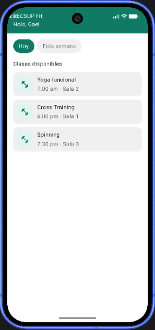
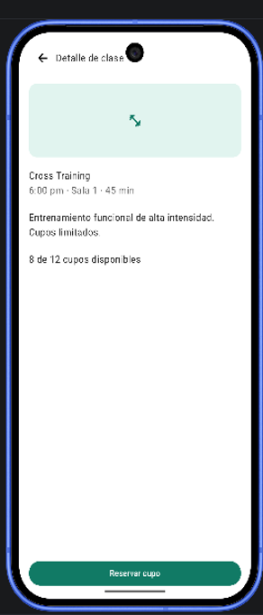
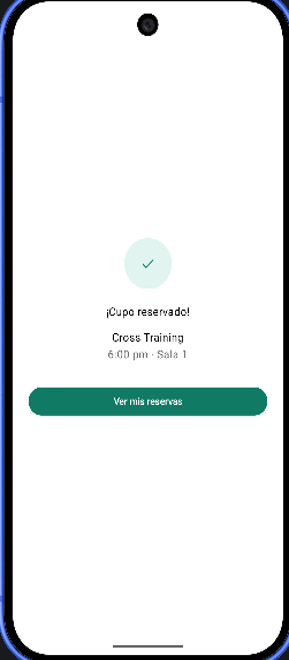
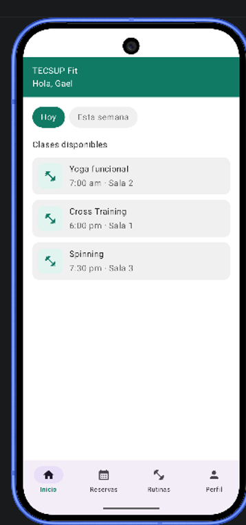
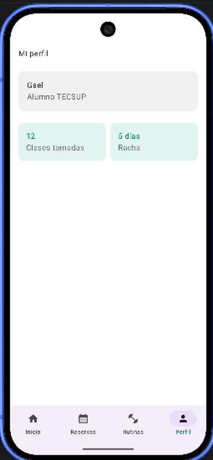

# TECSUP Fit ️

Aplicación móvil desarrollada en **Android con Jetpack Compose** para la gestión y reserva de clases deportivas dentro del campus TECSUP.

---

## Características Principales

* **Inicio**: Listado de clases disponibles con filtros dinámicos (Hoy / Esta semana).
* **Detalle de Clase**: Información detallada y selección única de horarios.
* **Reservas**: Estado visual de las clases reservadas (Confirmada / Completada).
* **Rutinas**: Catálogo de rutinas de entrenamiento.
* **Perfil**: Información del alumno y estadísticas de racha y clases tomadas.
* **Navegación**: Implementación de `BottomBar` integrada mediante `Scaffold`.

---

## Tecnologías Utilizadas

* **Lenguaje**: Kotlin
* **UI**: Jetpack Compose (Material Design 3)
* **Navegación**: Jetpack Navigation Compose
* **Control de Versiones**: Git & GitHub

---

# CAPTURAS

