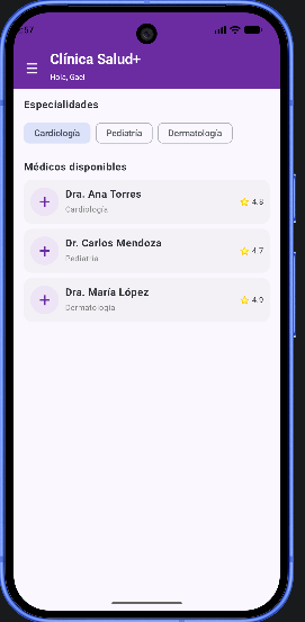
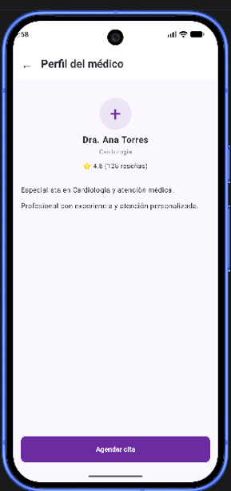
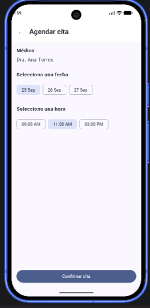
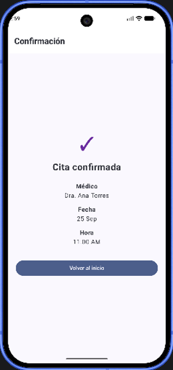
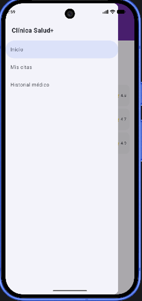

# Clínica Salud+
**Curso:** Programación en Móviles — TECSUP
**Docente:** Juan León S.
**Alumno:** Gael La Jara Barboza
**Tecnologías:** Kotlin, Jetpack Compose, Material 3, Navigation Compose

Aplicación de reserva de citas médicas que integra lo trabajado en las semanas 1 a 6:
layouts y controles, listas con LazyColumn/LazyRow, navegación secuencial con paso de
parámetros y navegación secundaria mediante menú lateral (NavigationDrawer). El estado
se maneja con `remember` y `mutableStateOf` (sin ViewModel ni MVVM).

## Ramas del repositorio

| Rama | Contenido |
| --- | --- |
| `main` | Fase 1 — App completa desarrollada **sin IA** |
| `mejora-ia` | Fase 2 — Mejora funcional/visual desarrollada **con IA** (ver `PROMPTS.md`) |

## Flujo secuencial

Inicio → Perfil del médico → Agendar cita → Confirmación

## Funcionalidades

- **Inicio:** chips de especialidad (LazyRow) y lista de médicos disponibles (LazyColumn), cada tarjeta con nombre, especialidad y calificación.
- **Perfil del médico:** recibe los datos del médico elegido por parámetro de navegación; muestra especialidad, años de experiencia, reseñas y descripción, con el botón "Agendar cita".
- **Agendar cita:** selección única de fecha y de hora antes de confirmar.
- **Confirmación:** resumen de la cita agendada (médico, fecha y hora) y botón "Ver mis citas".
- **Menú lateral (drawer):** se abre con el ícono ☰ de la barra superior y da acceso a Inicio, Mis citas e Historial médico.
- **Mis citas:** lista de citas agendadas con su estado (Confirmada / Completada) diferenciado visualmente.
- **Historial médico:** sección accesible desde el menú lateral.

## Capturas

